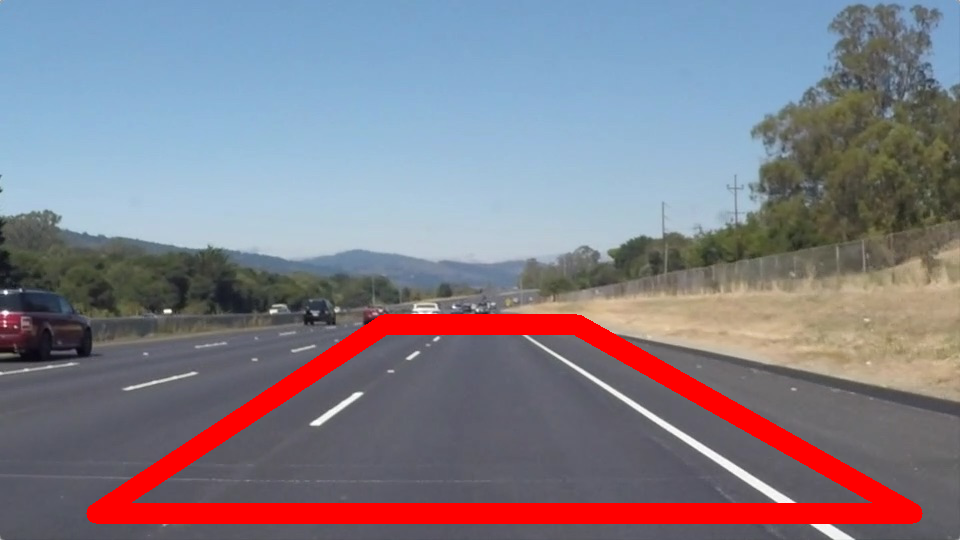

# **Finding Lane Lines on the Road**

## 1. Describe your pipeline. As part of the description, explain how you modified the draw_lines() function.
My pipeline consists of five steps:
1. Convert the input image into grayscale.
2. Apply Gussian smoothing on the grayscale. The size of the Gussian kernel is set to 5.
3. Apply canny edge detection, where the low threshold is set to 50 and the high threshold is set to 150, respecitively.
4. Select a region of interest by defining a four side polygon and setting pixels outside of this region to black. The region is set to [(0.1*xsize, 0.95*ysize),(0.4*xsize, 0.6*ysize), (0.6*xsize, 0.6*ysize), (0.95*xsize, 0.95*ysize)], where xsize is the image width and ysize is the image height. The region of interest is shown in .
5. Do the hough transform. Here are the paremeters I set: (rho = 2, theta = np.pi/180, threshold = 50, min_line_length = 50, max_line_gap = 100). After I got the lines from the hough transformation, the lines are first divided into two groups. For the line with slope < -0.5 and the two endpoints are in the left half image, the line is in the left group, while for the lines with slope > 0.5 and the two endpoints are in the right half image, the line is in the right group. For the lines in each group, an average slope and y-interest is calcuated. Then, I use the image height and 0.6 * image height on the average line to extrapolate the final line. Finally, an weight image is calculated based on the inital image and the lines just derived.

If you want to make the lines semi-transparent, think about combining
    this function with the weighted_img() function below