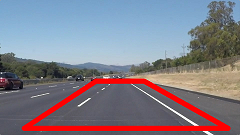

#**Finding Lane Lines on the Road**

###1. Describe your pipeline. As part of the description, explain how you modified the draw_lines() function.
My pipeline consists of six steps:
1. Convert the input image into grayscale.
2. Apply Gussian smoothing on the grayscale. The size of the Gussian kernel is set to 5.
3. Apply canny edge detection, where the low threshold is set to 50 and the high threshold is set to 150, respecitively.
4. Select a region of interest by defining a four side polygon and setting pixels outside of this region to black. The region is set to [(0.1*xsize, 0.95*ysize),(0.4*xsize, 0.6*ysize), (0.6*xsize, 0.6*ysize), (0.95*xsize, 0.95*ysize)], where xsize is the image width and ysize is the image height. The region of interest is shown in .
5. 
6.